# ⚖️ LexGuard: AI Rights & Contract Intelligence System

> **Exposing the fine print. Protecting consumer rights. In your own language.**

LexGuard is an advanced, production-grade AI platform designed to decode predatory contracts, complex Terms of Service (ToS), and EULAs in seconds. Built for the **Prompt-Wars Hackathon**, LexGuard uses a state-of-the-art **multi-agent pipeline** powered by Google Vertex AI to highlight risks, detect dark patterns, calculate power imbalances, and translate legal jargon into plain, actionable advice in multiple Indic languages.

---

## 🚀 Live Demo
🌍 **Production Dashboard:** [https://lexguard-1068366375204.us-central1.run.app](https://lexguard-1068366375204.us-central1.run.app)

---

## 🌟 Key Features

### 🛡️ 1. Multi-Stage Legal Risk Engine
Instead of analyzing the document in a single heavy prompt, LexGuard employs a **3-stage deterministic pipeline** (`temperature=0.0`) to provide high-precision, isolated analysis:
*   **Stage 1 (Parser & Classifier):** Scrapes the text, filters noise, identifies specific clauses, and classifies them into legal domains (Arbitration, Privacy, Termination, etc.).
*   **Stage 2 (Risk & Dark Pattern Scorer):** Runs a deep analysis on the classified clauses, assigning a granular risk score, identifying predatory dark patterns (e.g., hidden opt-outs, forced waivers), and calculating a **Power Imbalance Metric** (e.g., Company: 90% / You: 10%).
*   **Stage 3 (Consequence Simulator & Translator):** Simulates the worst-case real-world consequences of signing, generates a balanced, consumer-friendly alternative version, and translates all metrics into the user's selected language.

### 📁 2. Universal Document Uploader
LexGuard handles more than just pasted text. Our unified drag-and-drop uploader parses:
*   📄 **PDFs:** Scrapes structured text natively from multiple pages.
*   📝 **DOCX:** Extracts paragraphs and schedules cleanly.
*   📋 **Plain Text / TXT:** Standard copy-pasted agreements.

### 🌐 3. Full Native Localization (Indic Languages)
To ensure equal access to justice, LexGuard translates both the **UI labels** and **AI-generated legal explanations** natively. Fully supported languages include:
*   🇮🇳 **Hindi (हिंदी)**
*   🇮🇳 **Kannada (ಕನ್ನಡ)**
*   🇮🇳 **Tamil (தமிழ்)**
*   🇮🇳 **Telugu (తెలుగు)**

### 🧩 4. LexGuard Chrome Extension (MV3)
Real-time protection right in your browser! The extension scans active webpage DOMs to detect "I Agree" buttons, intercept clicks, and inject a warning modal to prevent users from blindly accepting terms before scanning.
*   Includes a dark-mode floating popup dashboard.
*   Uses a background service worker to fetch analysis securely, bypassing strict CORS blocks.

---

## 🏗️ System Architecture

```mermaid
graph TD
    A[Contract Document] -->|Upload PDF/DOCX or Paste Text| B(FastAPI Backend)
    B -->|Clean Text Heuristics| C[parser.py]
    
    subgraph 7-Agent Pipeline [Google Vertex AI - gemini-2.5-flash-lite]
        C -->|Call 1| D[Clause Extractor & Domain Classifier]
        D -->|JSON Output| E[Call 2: Risk Evaluator & Dark Pattern Detector]
        E -->|JSON Output| F[Call 3: Consequence Simulator & Indic Translator]
    end
    
    F -->|Deterministic JSON| G[Unified API Response]
    G -->|Dynamic Map| H[Premium Glassmorphic Dashboard]
    G -->|Chrome Event Hook| I[LexGuard Extension Popup]
    
    style 7-Agent Pipeline fill:#1e293b,stroke:#3b82f6,stroke-width:2px;
```



---

## ⚡ Under the Hood & Cost Optimization

LexGuard is built using highly optimized enterprise patterns to run at lightning speed for practically zero cost:
*   **Vertex AI Migration:** Migrated fully from Google AI Studio to Google Vertex AI to unlock stable pay-as-you-go enterprise quotas.
*   **Model Choice (`gemini-2.5-flash-lite`):** The entire system is built on Google's cheapest and fastest model.
    *   *Cost Efficiency:* At **$0.0375 / 1M input tokens**, a standard document analysis costs approximately **$0.0002**.
    *   *Scale:* A $5.00 GCP trial credit allows for **~19,000 document scans**, making it fully robust for large-scale production deployment.
*   **Deterministic Output:** All Gemini model instances use a `temperature=0.0` configuration to ensure that risk analysis, power balances, and scores are 100% reproducible and verifiable.

---

## 🛠️ Installation & Local Setup

### Backend & Dashboard Setup
1.  **Clone the Repository:**
    ```bash
    git clone https://github.com/chhhee10/Prompt-Wars.git
    cd Prompt-Wars
    ```

2.  **Set up Virtual Environment & Dependencies:**
    ```bash
    python3 -m venv venv
    source venv/bin/activate
    pip install -r requirements.txt
    ```

3.  **Configure Environment Variables:**
    Create a `.env` file in the root directory:
    ```env
    GCP_PROJECT="gen-lang-client-0301002559"
    GCP_LOCATION="us-central1"
    ```

4.  **Authenticate GCP Application Default Credentials (ADC):**
    Ensure you have `gcloud` installed, then login:
    ```bash
    gcloud auth application-default login
    ```

5.  **Run the Local Server:**
    ```bash
    uvicorn main:app --reload
    ```
    Open your browser to `http://127.0.0.1:8000` to interact with your local dashboard.

---

### Chrome Extension Setup
1.  Open Google Chrome and navigate to `chrome://extensions/`.
2.  Enable **Developer mode** (toggle in the top-right corner).
3.  Click **Load unpacked** in the top-left.
4.  Select the `extension/` folder inside the `Prompt-Wars` repository.
5.  Pin the LexGuard extension for instant contract interception!

---

## ☁️ Deploying to Google Cloud Run

To deploy your local changes to production in 1-click:
```bash
./google-cloud-sdk/bin/gcloud run deploy lexguard --source . --region us-central1 --allow-unauthenticated
```

---

## 📂 Code Structure

*   [main.py](file:///home/chetan/Desktop/Prompt-Wars/main.py) - FastAPI app containing endpoints for web rendering (`/`) and risk analysis (`/analyze`).
*   [parser.py](file:///home/chetan/Desktop/Prompt-Wars/parser.py) - Multi-format extractor handling TXT, PDF base64 streams, and DOCX files.
*   [agents/pipeline.py](file:///home/chetan/Desktop/Prompt-Wars/agents/pipeline.py) - Main Vertex AI orchestration pipeline configuring deterministic LLM calls.
*   [static/index.html](file:///home/chetan/Desktop/Prompt-Wars/static/index.html) - Beautiful, fully-localized consumer dashboard UI.
*   [extension/](file:///home/chetan/Desktop/Prompt-Wars/extension/) - Chrome Extension package (manifest, content script, and background bypass engine).

---

## 🛡️ License & Disclaimers
*LexGuard is an AI-powered legal intelligence tool designed to assist consumers in understanding standard terms. It does not constitute formal legal advice.*